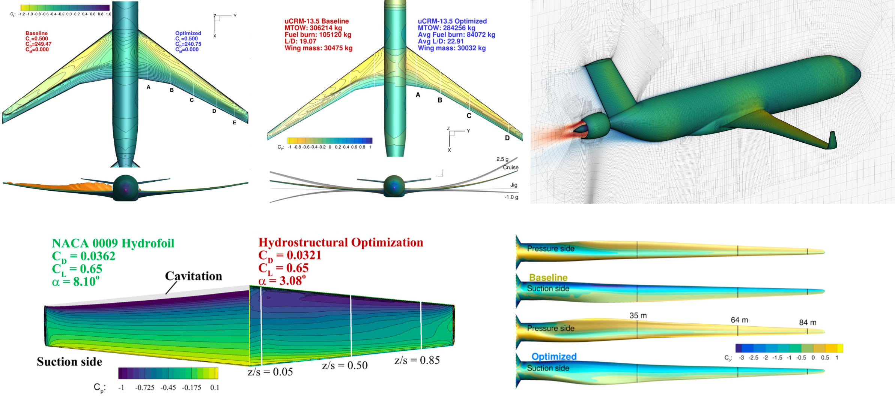

# ADflow
 

ADflow is a flow solver developed by the MDO Lab at the University of Michigan.
It solves the compressible Euler, laminar Navier–Stokes and Reynolds-averaged Navier–Stokes equations using structured multi-block and overset meshes.
ADflow's features include the following:

- Discrete adjoint implementation
- "Complexified" code for complex-step derivative verification
- Massively parallel (both CPU and memory scalable) implementation using MPI

ADflow has been used in aerodynamic, aerostructural, and aeropropulsive design optimization of aircraft configurations.
Furthermore, we used ADflow to perform design optimization of hydrofoils and wind turbines.

## Documentation
Please see the [documentation](https://mdolab-adflow.readthedocs-hosted.com/en/latest/) for installation details and API documentation.

To locally build the documentation, enter the `doc` folder and enter `make html` in terminal.
You can then view the built documentation in the `_build` folder.

## Citing ADflow

Please cite [the following paper](https://www.researchgate.net/publication/342358808_ADflow_An_Open-Source_Computational_Fluid_Dynamics_Solver_for_Aerodynamic_and_Multidisciplinary_Optimization) when using ADflow:

Charles A. Mader, Gaetan K. W. Kenway, Anil Yildirim, and Joaquim R. R. A. Martins, “ADflow: An Open-Source Computational Fluid Dynamics Solver for Aerodynamic and Multidisciplinary Optimization”, _Journal of Aerospace Information Systems_, 2020. doi: [10.2514/1.I010796](https://doi.org/10.2514/1.I010796)

In addition, you may cite these papers, depending on the focus of your work:

- **Approximate Newton–Kyrlov solver**. The theory and implementation of the approximate Newton–Krylov (ANK) solver in ADflow is detailed in [this paper](https://www.researchgate.net/profile/Joaquim_Martins/publication/333725868_A_Jacobian-free_approximate_Newton-Krylov_startup_strategy_for_RANS_simulations/links/5d03f226299bf12e7be014b5/A-Jacobian-free-approximate-Newton-Krylov-startup-strategy-for-RANS-simulations.pdf).

Anil Yildirim, Gaetan K. W. Kenway, Charles A. Mader, and Joaquim R. R. A. Martins, “A Jacobian-free approximate Newton–Krylov startup strategy for RANS simulations”, _Journal of Computational Physics_, 397:108741, November 2019. doi: [10.1016/j.jcp.2019.06.018](https://doi.org/10.1016/j.jcp.2019.06.018)

- **Adjoint implementation**. The adjoint implementation in ADflow, along with a general approach towards adjoint methods for CFD solvers is detailed in [this paper](https://www.researchgate.net/profile/Joaquim_Martins/publication/333518918_Effective_Adjoint_Approaches_for_Computational_Fluid_Dynamics/links/5cf26b7ea6fdcc8475fc169b/Effective-Adjoint-Approaches-for-Computational-Fluid-Dynamics.pdf).

Gaetan K. W. Kenway, Charles A. Mader, Ping He, and Joaquim R. R. A. Martins, “Effective Adjoint Approaches for Computational Fluid Dynamics”, _Progress in Aerospace Sciences_, 110:100542, October 2019. doi: [10.1016/j.paerosci.2019.05.002](https://doi.org/10.1016/j.paerosci.2019.05.002)

- **Overset capability**. The overset capability and implementation is described in [this paper](https://www.researchgate.net/publication/313459613_An_Efficient_Parallel_Overset_Method_for_Aerodynamic_Shape_Optimization):

Gaetan. K. W. Kenway, Ney Secco, Joaquim R. R. A. Martins, Asitav Mishra, and Karthik Duraisamy. "An efficient parallel overset method for aerodynamic shape optimization". In Proceedings of the _58th AIAA/ASCE/AHS/ASC Structures, Structural Dynamics, and Materials Conference_, AIAA SciTech Forum, Grapevine, TX, January 2017. doi: [10.2514/6.2017-0357](https://arc.aiaa.org/doi/10.2514/6.2017-0357).

## License
Copyright 2019 MDO Lab

Distributed using the GNU Lesser General Public License (LGPL), verstion 2.1; see
the LICENSE file for details.
