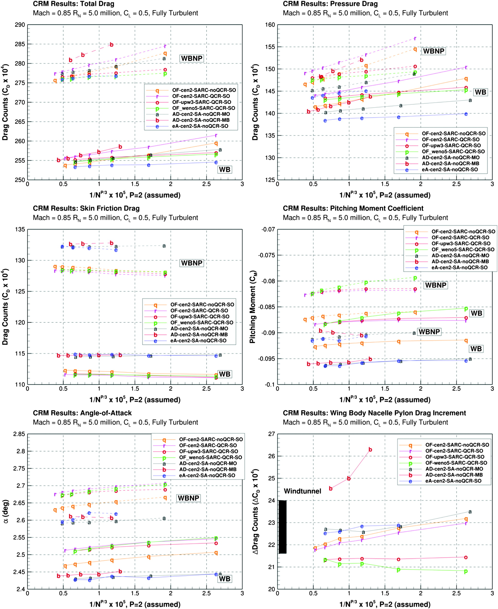
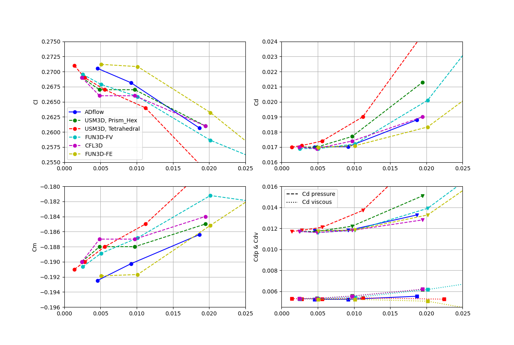
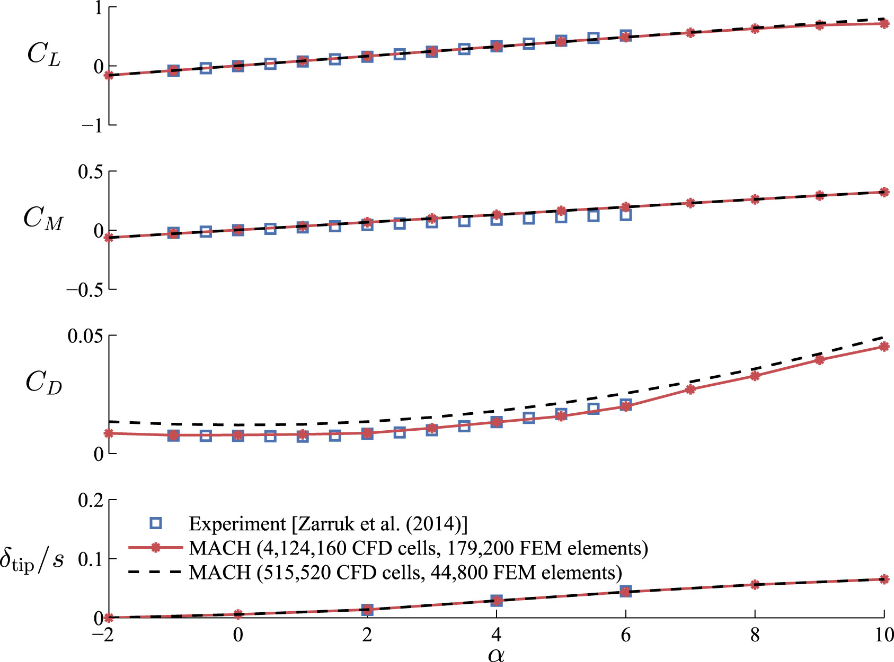
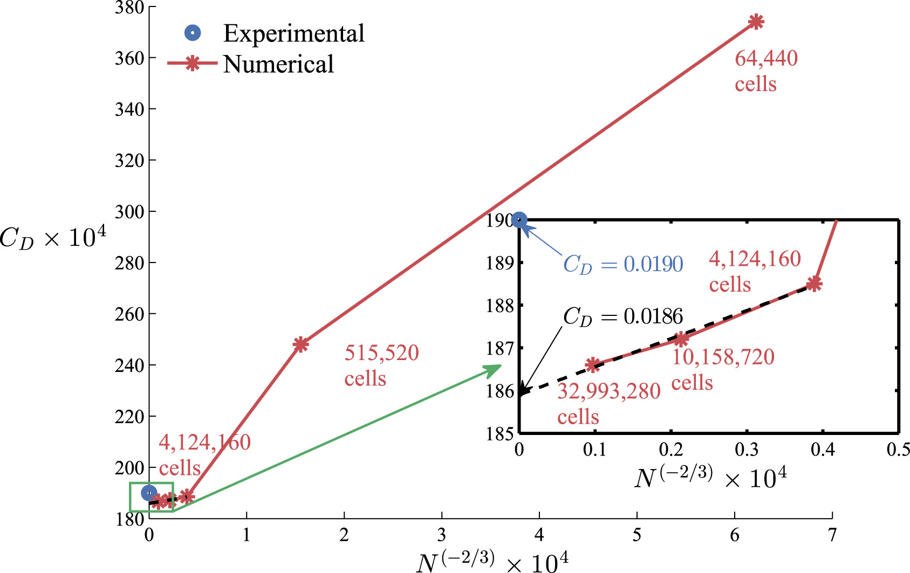
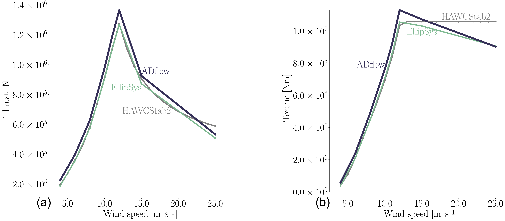

.. _verification:

Verification and Validation
===========================
This page documents major validation and verification cases for ADflow.

NASA Common Research Model (CRM)
--------------------------------
:cite:t:`Coder2017a` compares ADflow with OVERFLOW and elsA for the CRM Wing-Body and Wing-Body-Nacelle-Pylon configurations.
Both overset and multiblock structured meshes were used in the comparison.
The cases are run at a freestream Mach number of 0.85 and a Reynolds number of 5 million.
Figure 8 in this paper details the grid convergence of each of the flow solvers.

	Figure 8 from :cite:t:`Coder2017a`

ONERA M6
--------
The MACH-Aero tutorial contains a comparison of ADflow with other flow solvers for the ONERA M6 wing :ref:`here <mach-aero:overset_analysis>`.
The results section at the bottom of this page shows force and moment coefficient convergence of ADflow and other solvers.

Hydrofoils
----------
:cite:t:`Garg2017a` couples hydrodynamic and structural analysis of hydrofoils and compares the results with experimental data.
The CFD analysis uses a low-speed preconditioner to solve hydrodynamic problems that have nearly incompressible flow.
A NACA 0009 hydrofoil is analyzed at a Reynolds number of 1 million and compared to experimental results.
Figure 3 in this paper shows the comparison between the predicted force and moment coefficients and tip deflection with the experimental results.

	Figure 3 from :cite:t:`Garg2017a`

Figure 4 shows a drag convergence study, and the results approach experimental values.

	Figure 4 from :cite:t:`Garg2017a`

Wind Turbines
-------------
Analysis of wind turbines is conducted in :cite:t:`Madsen2019a`.
Appendix A compares ADflow to EllipSys3D at different flow conditions.
Figure 21 shows the thrust and torque calculations from ADflow and EllipSys3D.
These results show that ADflow consistently overshoots the EllipSys3D results at all wind speeds.

	
	Figure 21 from :cite:t:`Madsen2019a`
	
.. bibliography::
    :style: unsrt
